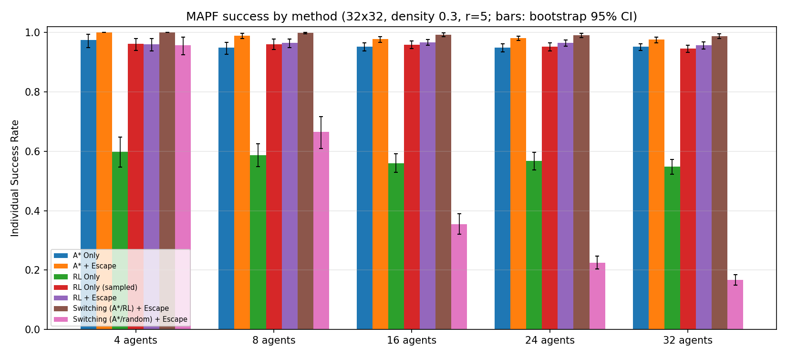
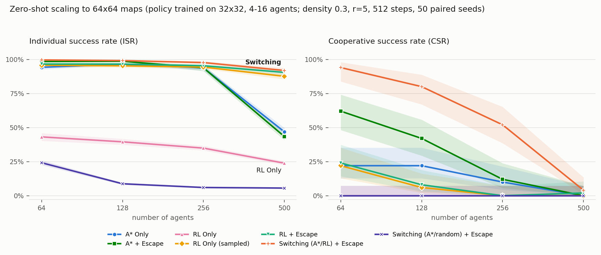

# Deadlock-Aware Adaptive Switching for Multi-Agent Pathfinding

**A per-agent, per-step controller that switches between A\*, a PPO policy, and intelligent deadlock escape — trained on 32×32 grids, scaling zero-shot to 64×64 maps with 500 agents.**

**Authors:** Roei Aviv · Omer Ben Simon
Course project — *Advanced Topics in AI*, Afeka Tel Aviv Academic College of Engineering.

**Interactive results site:** [omerbentzi.github.io/mapf-adaptive-switching](https://omerbentzi.github.io/mapf-adaptive-switching/)

---

## Overview

Coordinating many agents under **partial observability** is hard: each agent sees only an 11×11 egocentric window (observation radius r = 5), with no global map, no communication, and no central controller. Agents know only their own goal coordinates. The environment is POGEMA 1.4.0: 5 actions (stay/up/down/left/right), vertex and edge collisions blocked, finish-and-vanish goal semantics.

We build on the **"When to Switch"** framework (Skrynnik, Andreychuk, Yakovlev & Panov, IEEE TNNLS 2024), which alternates between classical planning (A\*) and a reinforcement-learning policy. Our contribution adds a third operational mode — **intelligent deadlock escape** — and a lightweight **adaptive switching controller** that chooses between the three per agent, per step:

| situation (per agent, per step) | mode |
|---|---|
| no progress over a sliding window — the last 4 positions contain ≤ 2 distinct cells, catching both frozen agents and 2-cell livelocks | **Escape** — a random *safe* move (avoids obstacles, visible agents, and stepping back) for 3 steps |
| other agents visible in the field of view | **RL** — PPO policy trained specifically on multi-agent interference |
| otherwise | **A\*** — optimal and cheap on the agent's accumulated obstacle-memory map (unknown cells assumed free; replans lazily) |

Partial observability is respected everywhere: each agent's planner uses only its own accumulated obstacle memory, its own goal coordinate, and the agents *currently visible* in its field of view. No global information is shared between agents.

## Headline results

### 32×32 (training scale) — density 0.3, r = 5, 256 steps, 100 paired episodes

Cooperative success rate (CSR — fraction of episodes where *all* agents reach their goals):

| method \ agents | 4 | 8 | 16 | 24 | 32 |
|---|---|---|---|---|---|
| A\* Only | 95% | 80% | 67% | 58% | 47% |
| A\* + Escape | 100% | 96% | 83% | 79% | 71% |
| RL Only (greedy) | 12% | 2% | 0% | 0% | 0% |
| RL Only (sampled) | 87% | 79% | 59% | 51% | 32% |
| RL + Escape | 86% | 79% | 63% | 56% | 46% |
| **Switching (A\*/RL) + Escape** | **100%** | **99%** | **95%** | **94%** | **89%** |
| Switching (A\*/random) + Escape | 92% | 30% | 1% | 0% | 0% |

*(Full aggregates, confidence intervals, and per-episode records: `checkpoints/results.json` and `checkpoints/episodes.csv`. The headline paired comparison is Switching vs. the strongest baseline, A\* + Escape.)*



- The switching advantage is **statistically significant** where it matters: exact McNemar p = 0.012 / 0.0026 / 0.0005 at 16 / 24 / 32 agents.
- The 24- and 32-agent settings are themselves **zero-shot** — training only ever saw up to 16 agents.
- The **random-RL ablation collapses** (89:0 discordant episodes at 32 agents): the learned policy is load-bearing, not just the A\*/escape scaffold around it.
- Mode usage shifts from A\* 74% → 14% and RL 23% → 73% as the agent count grows from 4 to 32 — the controller adapts to congestion by design.
- **Honest trade-off:** makespan at 32 agents is **+12 steps** vs. A\* + Escape (p = 0.02). Switching solves more instances, but the escapes and RL detours cost time on the instances both methods solve.
- A zero-shot **observation-radius sweep** (r = 3/5/7, no retraining) is included in `results.json` under `"radius_sweep"`.

### 64×64 zero-shot scaling — density 0.3, r = 5, 512 steps, 50 paired seeds

The 32×32-trained checkpoint evaluated with **no retraining** at the scale of the original paper (64×64 maps, up to 500 agents). Individual success rate (ISR — fraction of agents reaching their goals):

| method \ agents | 64 | 128 | 256 | 500 |
|---|---|---|---|---|
| A\* Only | 94.2% | 96.4% | 93.8% | 46.9% |
| A\* + Escape | 98.4% | 98.6% | 93.8% | 43.4% |
| RL Only (greedy) | 43.1% | 39.5% | 34.9% | 23.8% |
| RL Only (sampled) | 95.7% | 95.3% | 94.3% | 87.6% |
| RL + Escape | 96.6% | 96.5% | 95.3% | 90.4% |
| **Switching (A\*/RL) + Escape** | **99.6%** | **99.1%** | **97.7%** | **91.9%** |
| Switching (A\*/random) + Escape | 24.2% | 8.7% | 6.0% | 5.6% |



CSR (episodes solved out of 50): Switching **47 / 40 / 26 / 2** vs. next-best A\* + Escape 31 / 21 / 6 / 0.

Paired tests, Switching vs. A\* + Escape:

- CSR: McNemar p = 0.0001 at 64 agents (17:1 discordant), p = 0.0002 at 128 (22:3), p < 0.0001 at 256 (21:1).
- At **500 agents** CSR saturates near zero for everyone (2:0, p = 0.5 — no power); the signal there is ISR: **+48.5 points, p = 0.0001**.
- **Honest reporting:** at **128 agents** the ISR difference (+0.5 pts) is **not significant** (p = 0.22, ceiling effect) — the CSR test is the significant one at that count.

Switcher mode usage (fraction of agent-steps):

| agents | A\* | RL | Escape |
|---|---|---|---|
| 64 | 24.7% | 65.1% | 10.2% |
| 128 | 12.2% | 73.6% | 14.2% |
| 256 | 5.1% | 75.4% | 19.5% |
| 500 | 1.4% | 72.2% | 26.4% |

**Key findings at 64×64:**

1. **Switching is strongest at every scale**, and the only method with substantial CSR at 256 agents.
2. **Pure planning collapses under congestion**: A\* drops from 94% to 47% ISR at 500 agents (where roughly 17% of free cells are occupied). The switcher's A\* share drops to 1.4% there — by design.
3. **Greedy RL locks into oscillations** (≤ 43% ISR everywhere), while *sampling* from the very same network holds 87.6% at 500 agents.
4. **Reproduces the original paper's headline finding at its own scale**: their ASwitcher exceeds 80% at 500 agents; our switcher reaches 91.9% ISR — zero-shot from a model trained on 32×32.

> **Caveat on the paper comparison:** the original paper's 500-agent instances are maze/warehouse maps (MovingAI benchmark); ours are uniform-random grids. We match the paper's *scale*, not its exact benchmark maps.

The full 64×64 evaluation costs ~5 CPU-hours fanned out over parallel workers on an Apple M-series machine.

## Method & architecture

- **Actor-Critic CNN**: 3 × (Conv 3×3) with 32→64→64 channels, followed by radius-agnostic adaptive pooling to 5×5 → FC-256 → actor head (5 actions) + critic head (1 value).
- **Input**: 4 channels — obstacles / projected target / visible agents / visited-cells memory — each of size (2r+1)×(2r+1).
- The network **never sees the map size**, so the policy is **map-size agnostic** (that is what makes the 64×64 zero-shot evaluation possible) and **radius-agnostic** (evaluable at r = 3/5/7 without retraining).
- **Training**: PPO with GAE, minibatches, and proper truncation bootstrapping. Reward: distance-progress shaping + goal bonus.
- Trained locally on Apple silicon (MPS) in ~1.5 h: 8,000 episodes on 32×32 grids, density 0.3, agent mix {4, 8, 16}, 256-step horizon.

## Repository layout

```
mapf/
  env.py        POGEMA-based environment wrapper (4-channel observations,
                distance-progress reward, finish-and-vanish goal semantics,
                per-agent global obstacle memory + visited map)
  model.py      Actor-Critic CNN; AdaptiveAvgPool makes it radius-agnostic
  planners.py   A* on partial maps, deadlock monitor, smart escape,
                and the evaluated policies incl. the switching controller
  ppo.py        PPO with GAE (proper truncation bootstrapping) + minibatches
train.py        resumable PPO training (env-var config)
evaluate.py     paired-seed evaluation + statistics + figure (env-var config)
tests/          17 pytest unit tests (deterministic POGEMA instances)
RL_PROJECT_FINAL.ipynb   full pipeline notebook, all outputs embedded (Sections 1–8)
checkpoints/     best_model.pt · results.json · results.png · episodes.csv · train_log.json
checkpoints_64/  results_64.json · results_64.png · best_model.pt (copy)
docs/            GitHub Pages site (index.html + assets)
```

## Quickstart

### Colab

Open `RL_PROJECT_FINAL.ipynb`, select a GPU runtime, and run the cells top-to-bottom. The install cell requires one runtime restart (numpy downgrade). Training checkpoints go to Google Drive, so a disconnected session loses at most 15 minutes — just re-run the training cell to resume.

### Local

```bash
pip install "numpy<2.0" "pydantic<2.0" "gymnasium==0.28.1" torch matplotlib pytest
pip install "pogema==1.4.0" --no-build-isolation
```

All entry points are configured through environment variables:

```bash
# unit tests
python -m pytest tests -q

# training (resumable — re-run the same command to continue)
MAX_HOURS=3.5 python train.py
# also accepts SEED, AGENT_MIX, MAP_SIZE, ... env vars

# 32×32 evaluation (tables, results.json, results.png)
EPISODES=100 AGENTS=4,8,16,24,32 python evaluate.py

# 64×64 zero-shot evaluation (one-liner, reproduces the scaling table above)
CKPT_DIR=checkpoints_64 MAP_SIZE=64 AGENTS=64,128,256,500 MAX_STEPS=512 EPISODES=50 SKIP_SWEEP=1 python evaluate.py
```

`evaluate.py` runs independently of training: it loads `best_model.pt` from `CKPT_DIR` (falling back to the latest `checkpoint.pt`), so results can be produced even if a training session was cut short.

## Evaluation protocol & statistics

- **Paired seeds**: every method runs the *exact same* instances (seeds 90000+); since the environment dynamics RNG is derived from the episode seed, move-order dynamics are identical too. The episode is the unit of analysis.
- **7 configurations**: A\* Only · A\* + Escape · RL Only (greedy) · RL Only (sampled) · RL + Escape · **Switching (A\*/RL) + Escape** (the contribution) · Switching (A\*/random) + Escape (ablation: replaces the RL policy with a random one to test whether the learned policy is load-bearing).
- **Metrics**: ISR (fraction of agents reaching goals), CSR (fraction of episodes where *all* agents succeed), makespan (solved episodes only), and the switcher's mode-usage distribution.
- **Statistics**: exact McNemar tests on discordant episode pairs (CSR), sign-flip permutation tests + bootstrap confidence intervals (ISR), Wilson CIs on proportions. Makespan is compared on *jointly-solved* episodes only — per-method makespan columns condition on that method's successes and must not be compared directly.

## Testing

```bash
python -m pytest tests -q
```

17 unit tests on small deterministic POGEMA instances: observation-channel alignment, global memory accumulation, reward shaping and goal semantics, A\* optimality/detours/temporary obstacles, deadlock detection (frozen + oscillation), escape safety, switching-mode selection, hand-checked GAE values, truncation bootstrapping, a full PPO update, and per-seed determinism.

## Reference

Skrynnik, A., Andreychuk, A., Yakovlev, K., & Panov, A. (2024). *When to Switch: Planning and Learning to Adapt in Multi-Agent Pathfinding.* IEEE Transactions on Neural Networks and Learning Systems. DOI: [10.1109/TNNLS.2023.3303502](https://doi.org/10.1109/TNNLS.2023.3303502)

## License

MIT
